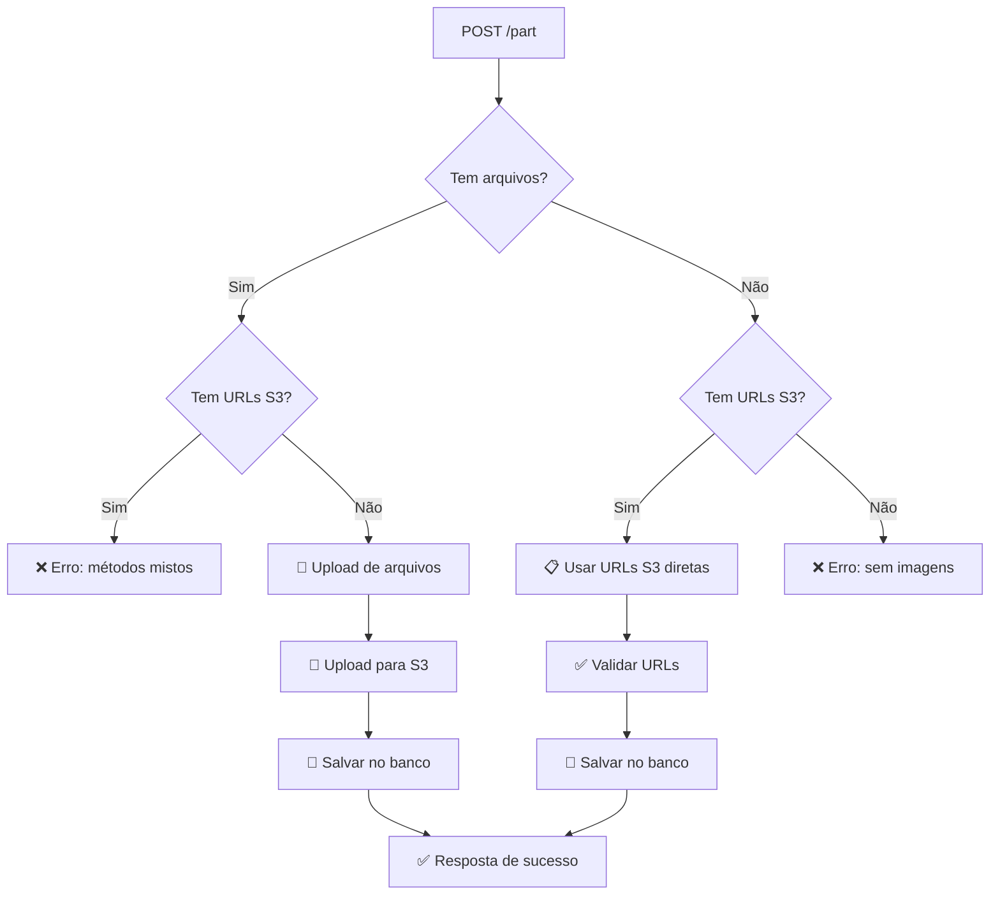

# 🚀 Nova Funcionalidade: URLs S3 Diretas

## 📋 Resumo

O endpoint `POST /part` agora suporta **duas formas** de adicionar imagens às peças:

1. **Upload de arquivos** (comportamento original)
2. **URLs S3 diretas** (nova funcionalidade - evita re-upload)

## 🎯 Quando Usar URLs S3 Diretas

✅ **Use URLs S3 quando:**
- Você já tem imagens uploadadas no S3
- Quer evitar upload desnecessário 
- Está criando peças duplicadas/similares
- Tem URLs de imagens de outras peças

❌ **Não use URLs S3 quando:**
- Você tem arquivos locais para enviar
- As imagens ainda não estão no S3

## 🔧 Como Usar

### Método 1: Upload de Arquivos (Original)

**Postman Configuration:**
```
Method: POST
URL: http://localhost:3000/part
Headers: Content-Type: multipart/form-data

Body (form-data):
- name: "Para-choque Dianteiro"
- description: "Para-choque original em bom estado"
- condition: "BOA"
- stock_address: "Setor A - Prateleira 15"
- car_id: "VHC001"
- files: [arquivo1.jpg, arquivo2.jpg, arquivo3.jpg]
```

### Método 2: URLs S3 Diretas (Nova Funcionalidade) ⭐

**Postman Configuration:**
```
Method: POST
URL: http://localhost:3000/part
Headers: Content-Type: multipart/form-data

Body (form-data):
- name: "Para-choque Dianteiro"
- description: "Para-choque original em bom estado"
- condition: "BOA"
- stock_address: "Setor A - Prateleira 15"
- car_id: "VHC001"
- s3_image_urls: ["https://s3.amazonaws.com/bucket/part1/img1.jpg", "https://s3.amazonaws.com/bucket/part1/img2.jpg"]
```

**⚠️ Importante:** O campo `s3_image_urls` deve ser um JSON string contendo um array de URLs.

## 📝 Exemplos Detalhados

### Exemplo 1: Usando URLs S3 no Postman

1. **Configuração da Requisição:**
   - Method: `POST`
   - URL: `http://localhost:3000/part`
   - Headers: `Content-Type: multipart/form-data`

2. **Body (form-data):**
   ```
   Key: name
   Value: Para-choque Traseiro

   Key: description  
   Value: Para-choque traseiro original

   Key: condition
   Value: BOA

   Key: stock_address
   Value: Setor B - Prateleira 20

   Key: car_id
   Value: TOCOR23PT010

   Key: s3_image_urls
   Value: ["https://racaforte-bucket.s3.amazonaws.com/parts/part_abc123/image1.jpg", "https://racaforte-bucket.s3.amazonaws.com/parts/part_abc123/image2.jpg"]
   ```

### Exemplo 2: Como Obter URLs S3 Existentes

Para obter URLs de uma peça existente:

```bash
# 1. Busque uma peça existente
curl -X GET "http://localhost:3000/part/PART_ID_AQUI"

# 2. Copie as URLs do campo "images" da resposta
{
  "success": true,
  "data": {
    "id": "part_123",
    "name": "Para-choque Original",
    "images": [
      "https://racaforte-bucket.s3.amazonaws.com/parts/part_123/image1.jpg",
      "https://racaforte-bucket.s3.amazonaws.com/parts/part_123/image2.jpg"
    ]
  }
}

# 3. Use essas URLs no campo s3_image_urls para criar uma peça similar
```

### Exemplo 3: JavaScript/Fetch

```javascript
// Função para criar peça com URLs S3
async function createPartWithS3Urls(partData, imageUrls) {
  const formData = new FormData();
  
  // Adiciona dados da peça
  formData.append('name', partData.name);
  formData.append('description', partData.description);
  formData.append('condition', partData.condition);
  formData.append('stock_address', partData.stock_address);
  formData.append('car_id', partData.car_id);
  
  // Adiciona URLs S3 como JSON string
  formData.append('s3_image_urls', JSON.stringify(imageUrls));
  
  try {
    const response = await fetch('/part', {
      method: 'POST',
      body: formData
    });
    
    const result = await response.json();
    
    if (result.success) {
      console.log('Peça criada com sucesso:', result.data);
      return result.data;
    } else {
      throw new Error(result.error.message);
    }
  } catch (error) {
    console.error('Erro ao criar peça:', error);
    throw error;
  }
}

// Uso da função
const imageUrls = [
  "https://racaforte-bucket.s3.amazonaws.com/parts/part_abc/img1.jpg",
  "https://racaforte-bucket.s3.amazonaws.com/parts/part_abc/img2.jpg"
];

const partData = {
  name: "Para-choque Lateral",
  description: "Para-choque lateral direito",
  condition: "BOA",
  stock_address: "Setor C - Prateleira 5",
  car_id: "VHC002"
};

createPartWithS3Urls(partData, imageUrls)
  .then(part => console.log('Peça criada:', part))
  .catch(error => console.error('Erro:', error));
```

## ⚡ Validações e Regras

### ✅ Validações que Passam:
```json
{
  "s3_image_urls": [
    "https://racaforte-bucket.s3.amazonaws.com/parts/part_123/image1.jpg",
    "https://another-bucket.s3.amazonaws.com/folder/image2.png"
  ]
}
```

### ❌ Validações que Falham:
```json
// URLs inválidas
{
  "s3_image_urls": ["not-a-url", "ftp://invalid.com/img.jpg"]
}

// Muitas imagens (máximo 5)
{
  "s3_image_urls": ["url1", "url2", "url3", "url4", "url5", "url6"]
}

// Tentando usar ambos os métodos
{
  "s3_image_urls": ["url1.jpg"],
  "files": [arquivo.jpg]  // ❌ Não permitido
}
```

## 🔍 Logs e Debugging

Quando usar URLs S3, você verá logs como:
```
📊 DEBUG - URLs S3 fornecidas: 2
📋 DEBUG - Usando URLs S3 diretas, pulando upload...
✅ DEBUG - URLs S3 validadas: ["url1.jpg", "url2.jpg"]
💾 DEBUG - Criando peça no banco com URLs S3 diretas...
✅ Peça criada com URLs S3 diretas: part_xyz789
```

## 🎯 Casos de Uso

### 1. Duplicar Peça Existente
```bash
# 1. Busque dados da peça original
GET /part/ORIGINAL_PART_ID

# 2. Use as mesmas imagens para criar peça similar
POST /part
Body: dados_da_nova_peca + s3_image_urls_da_original
```

### 2. Peça com Imagens de Múltiplas Fontes
```javascript
// Combine URLs de diferentes peças
const imageUrls = [
  ...partA.images.slice(0, 2),  // 2 imagens da peça A
  ...partB.images.slice(0, 1),  // 1 imagem da peça B
  ...partC.images.slice(0, 2)   // 2 imagens da peça C
];
```

### 3. Migração de Dados
```javascript
// Para migrar peças de outro sistema
const existingParts = await getPartsFromOldSystem();

for (const oldPart of existingParts) {
  await createPartWithS3Urls(oldPart.data, oldPart.s3_urls);
}
```

## 🚨 Códigos de Erro

| Código | Erro | Solução |
|--------|------|---------|
| 400 | `no_images` | Envie arquivos OU URLs S3 |
| 400 | `mixed_image_methods` | Use apenas um método |
| 400 | `too_many_images` | Máximo 5 imagens |
| 400 | `validation_error` | Verifique formato das URLs |

## 🔄 Fluxo de Processamento



## 🎉 Vantagens da Nova Funcionalidade

- ⚡ **Performance**: Evita re-upload desnecessário
- 🔄 **Reutilização**: Use imagens de peças existentes  
- 📦 **Flexibilidade**: Combine imagens de fontes diferentes
- 💾 **Economia**: Reduz uso de banda e storage
- 🚀 **Velocidade**: Criação de peças muito mais rápida

---

**💡 Dica:** Use o endpoint `GET /part/ID` para buscar uma peça existente e copiar suas URLs de imagem para criar peças similares rapidamente!